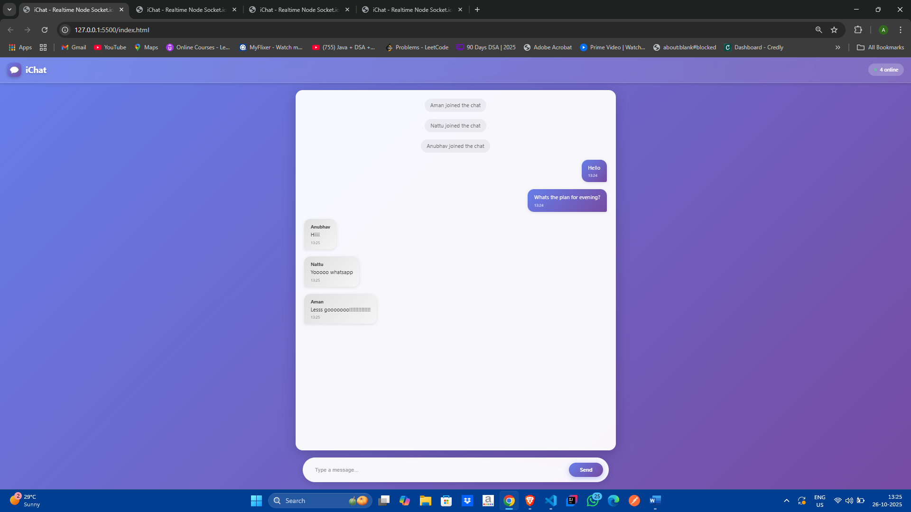
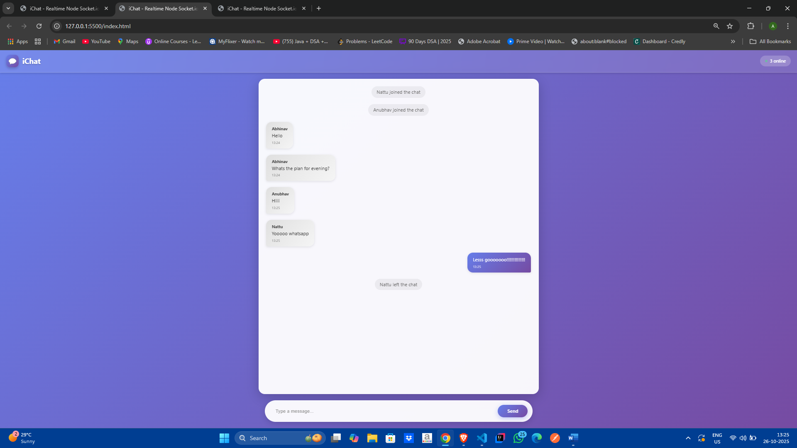

# 🗨️ iChat – Realtime Chat Application using Node.js & Socket.IO
🚀 Overview

iChat is a real-time chat application built using Node.js and Socket.IO, enabling instant communication between multiple users. It features live user count updates, join/leave notifications, timestamps, and a clean, responsive interface — all running seamlessly in real time.

# ✨ Features

1. 💬 Instant Messaging – Send and receive messages in real time.

2. 👥 Live User Count – Displays how many users are currently online.

3. 🔔 Join/Leave Alerts – Notifies when users enter or leave the chat.

4. 🕒 Timestamps – Automatically shows message sending times.

5. 🔊 Notification Sound – Plays a subtle tone for incoming messages.

6. 🎨 Modern UI – Built with responsive design for desktop and mobile.

# 🧠 Tech Stack

| Layer  | Technology       | 
|:------|:------------|
| Frontend: | HTML, CSS, Javascript  |
| Backend:  | Node.js   | USA     |
| Real Time Communicaton: | Socket.IO  | 
| Server Hosting Port:  | 8000   | 

# ⚙️ Setup & Installation
1️⃣ Clone the Repository

git clone https://github.com/abhinav-mishra12/Real-Time-Chat-App.git

cd real-time-chat-app

2️⃣ Install Dependencies

npm install socket.io

(No Express needed — this app runs directly with Socket.IO on port 8000.)

3️⃣ Run the Server

node server.js

The server will start at:
👉 http://localhost:8000

4️⃣ Open the Frontend

Simply open the index.html file in your browser.
You can also serve it using a local web server (like VS Code Live Server extension).

# 🖼️ Folder Structure

iChat/
│
├── server.js             # Node.js server (Socket.IO backend)
│
├── index.html            # Frontend UI
│
├── js/
│   └── client.js         # Client-side Socket.IO logic
│
└── style/
    └── style.css         # Styling and responsive layout

# 🔄 How It Works

1. When a user opens the app, they’re prompted to enter a name.

2. Their client connects to the Socket.IO server on port 8000.

3. The server registers the new user, updates the count, and notifies others.

4. Messages are emitted via send events and broadcast to all connected clients.

5. When a user disconnects, the server updates the count and alerts others.

# 📸 Screenshots

# 🧩 Future Enhancements

1. 🔐 Add user authentication (via JWT or OAuth)

2. 💾 Store chat history using MongoDB or Firebase

3. 🕹️ Add private/group chat rooms

4. 🌐 Deploy backend to Render/Heroku and frontend to Netlify/Vercel

# 👨‍💻 Author

 Abhinav Mishra

📫 mishra.k.abhinav@gmail.com

🔗 abhinav-mishra12

